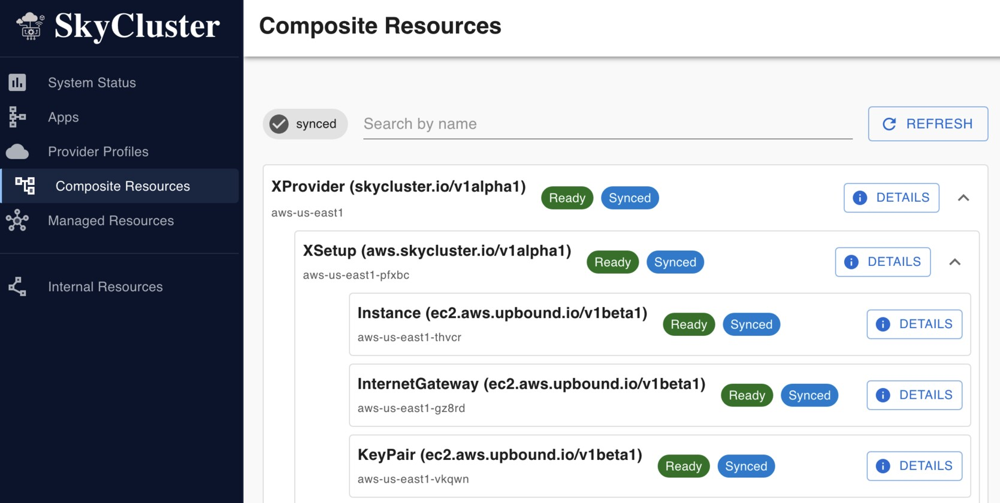

Quick Start Examples
============================

This section provides quick start examples to help you get up and running with the SkyCluster. 

SkyCluster offers a unified plane across multiple providers to support running your applications in a multi-cloud environment. However, you can also use SkyCluster to deploy and manage applications within a single cloud provider or on-premises environment. The following examples demonstrate how to use SkyCluster in different deployment scenarios.

Single-Provider Example
-----------------------------------

Provision an environment where you can use as development and testing environment within a single cloud provider. When you are ready to deploy your application to production, you can easily migrate your workloads to a multi-cloud setup. 

  - Ensure you have followed the :doc:`installation </getting-started/installation>` section.
  - Ensure you have set up your cloud provider as described in the :doc:`provider profile </getting-started/providers-profile>` section.

Set up your provider
^^^^^^^^^^^^^^^^^^^^^^

Use yaml file below to prepare your cloud provider:

.. code-block:: yaml

  # Unique identifier for the setup/application
  applicationId: single-provider-example
  
  vpcCidr: 10.40.0.0/16
  # Subnet CIDRs should be within the VPC CIDR range
  subnets:
    - type: public
      # must be within the VPC CIDR range
      # and not have overlap with other subnets
      cidr: 10.40.0.0/19	
      zone: us-east-1a
    
      # Some services such as EKS require multiple availability zones
      # so we define a secondary zone here
    - type: private
      cidr: 10.40.32.0/19	
      zone: us-east-1b

  # Provider specifications
  providerRef:
    platform: aws
    region: us-east-1
    zones:
      # The provider is identified by the primary zone
      primary: us-east-1a
      # Secondary zones are used for high availability or services
      # that require multiple availability zones such as EKS
      secondary: us-east-1b

Create your environment by running the following command:

.. code-block:: bash

  skycluster create -f single-provider-example.yaml -n aws-us-east-1

  # Verify the environment is created, 
  # All fields must be populated
  skycluster xprovider list
  # NAME            PRIVATE_IP    PUBLIC_IP    CIDR_BLOCK
  # aws-us-east1                               10.40.0.0/16

You can use the dashboard to monitor and manage the resources hierarchy:

Create a virtual machine
^^^^^^^^^^^^^^^^^^^^^^^^^

Now let's deploy a virtual machine with docker runtime to run your containerized application:

.. code-block:: yaml

  applicationId: aws-us-east
  flavor: 2vCPU-4GB
  image: ubuntu-22.04

  # You don't need to specify public IP
  # since you can access the VM via overlay
  # publicIp: true

  rootVolumes:
    - size: "20"
      type: gp2 # AWS specific volume type

  # Docker container specifications
  # All variables must be specified even if empty
  dockerSpec: |
    IMAGE="nginxdemos/hello:latest"
    NAME="demo-hello"

    # Port mappings as "host:container" separated by space
    PORT_MAPPINGS="8080:80 9090:90"

    # Environment variables as "KEY=value" separated by space
    ENVS="DEMO=1 ENV=dev"

    RESTART="--restart unless-stopped"
  
  providerRef:
    platform: aws
    region: us-east-1
    zone: us-east-1a

Check the status using cli or dashboard:

.. code-block:: bash

  skycluster xinstance list
  # NAME     PRIVATE_IP    PUBLIC_IP    SPOT    SYNC    READY
  # awsvm    10.40.34.5    -            True    True    True

Connect to the VM using overlay network:

.. code-block:: sh

  # First ensure ssh is enabled on the provider(s)
  skycluster xprovider ssh --enable
  # added/updated ssh entry for aws-us-east -> 18.213.192.77

  # Then connect to the VM using provider name as proxy jump host
  skycluster xinstance list
  # NAME      PROVIDER       PRIVATE_IP     PUBLIC_IP    SPOT    SYNC    READY
  # awsvm1    aws-us-east    10.40.58.36    -            True    True    True

  # now use the provider as jump host to access the VM
  ssh -J aws-us-east ubuntu@10.40.58.36

Create a Kubernetes Cluster
^^^^^^^^^^^^^^^^^^^^^^^^^^^^^

Just like creating a VM, you can create a Kubernetes cluster within the same provider. There are subtle differences in the configuration depending on the cloud provider. Please refer to the :doc:`reference </references/index>` section for more details. Below is an example for AWS EKS and GCP GKE. 

.. tabs::

  .. tab:: AWS EKS

    .. code-block:: yaml

      # Unique identifier for the setup/application
      applicationId: aws-us-east
      
      # Service CIDR should be a non overlapping CIDR with the VPC CIDR
      serviceCidr: 10.255.0.0/16
      
      podCidr: 
        # AWS requires two zones to deploy an EKS cluster
        # Each zone requires a non-overlapping subnet 
        cidr: 10.40.128.0/17 
        public: 10.40.128.0/18
        private: 10.40.192.0/18
      
      # There is a one node group automatically created to support
      # the control plane. You can define additional node groups here.
      # The number of node groups scales with yout workload.
      nodeGroups:
      - instanceTypes: ["4vCPU-16GB"]
        publicAccess: false
        
      - instanceTypes: ["2vCPU-4GB"]
        publicAccess: false
        
      principal:
        type: servicePrincipal # user | role | serviceAccount | servicePrincipal | managedIdentity
        id: "arn:aws:iam::885707601199:root" # ARN (AWS) | member (GCP) | principalId (Azure)
      providerRef:
        platform: aws
        region: us-east-1
        zones:
          # The provider is identified by the primary zone
          # Secondary zones are used for high availability or services
          # that require multiple availability zones such as EKS
          primary: us-east-1a
          secondary: us-east-1b

  .. tab:: GCP GKE

    .. code-block:: yaml

      # Unique identifier for the setup/application
      applicationId: gcp-us-central1

      # The node CIDR should be a non overlapping CIDR 
      # within 10.0.0.0/8 range
      nodeCidr: 10.18.128.0/18 
      
      # Pod adn services CIDR are specified in one block
      # within 172.16.0.0/12 range. Generally, /20 blocks within
      # this range are used for services.
      podCidr: 
        cidr: 172.20.0.0/16
      
      nodeGroups: 
      - instanceTypes: [4vCPU-16GB]
        publicAccess: false
        # Optionally specify auto scaling parameters
        autoScaling:
          minSize: 1
          maxSize: 4

      # - instanceTypes: "4vCPU-4GB"
      #   publicAccess: false
        
      providerRef:
        platform: gcp
        region: us-central1
        zones:
          primary: us-central1-b

Try checking the status of your cluster:

.. code-block:: sh

  skycluster xkube list
  # NAME                 PLATFORM    POD_CIDR          SERVICE_CIDR     LOCATION      EXTERNAL_NAME
  # xkube-aws-us-east    aws         10.40.128.0/17    10.255.0.0/16    us-east-1a    xkube-aws-us-east-ghgxd

Try accessing the cluster using kubectl:

.. code-block:: sh

  skycluster xkube config -k xkube-aws-us-east -o /tmp/aws1_kubeconfig
  # Wrote kubeconfig to /tmp/aws1_kubeconfig

  KUBECONFIG=/tmp/aws1_kubeconfig kubectl get nodes
  # NAME                             STATUS   ROLES    AGE   VERSION
  # ip-10-40-128-10.ec2.internal     Ready    <none>   10m   v1.24.6-eks-6c8b9f
  # ip-10-40-192-12.ec2.internal     Ready    <none>   10m   v1.24.6-eks-6c8b9f

  # Use k9s for better kubernetes experience (if installed)
  KUBECONFIG=/tmp/aws1_kubeconfig k9s

For some providers such as AWS, you have a flat network between VMs and Kubernetes pods. You can access your pod directly from the VM and vice versa without any additional setup. However, for providers such as GCP, this may not be the case, since the Pod CIDR is not routable from the VM by default. 

For more examples on running applications and pipelines automatically on SkyCluster, please refer to the :doc:`examples </examples/index>` section.

Multi-Provider Example
-----------------------------------

Now let's look at an example of setting up a multi-cloud environment using SkyCluster. In this example, we will provision resources across AWS and GCP providers with inter-cluster connectivity.

Virtual machines
^^^^^^^^^^^^^^^^^^^^^^

You can create virtual machines across multiple providers as described above. There is no additional configuration needed since SkyCluster automatically sets up the overlay network across all providers. You have reachability between VMs across different providers using the private IPs.

Kubernetes clusters
^^^^^^^^^^^^^^^^^^^^^^^^^^^^^

You can create Kubernetes clusters across multiple providers as described above. To enable reachability between pods and services across different providers, you need to follow these additional steps.

  **Prerequisites:**

  - Ensure there are at least two providers set up in your SkyCluster environment.
  - Ensure you have created Kubernetes clusters on each provider as described above.

Once you have at least two Kubernetes clusters, try activate the inter-cluster connectivity feature:

.. code-block:: bash

  skycluster xkube interconnect --enable
  # Inter-cluster connectivity enabled between clusters:
  # - xkube-aws-us-east
  # - xkube-gcp-us-central1