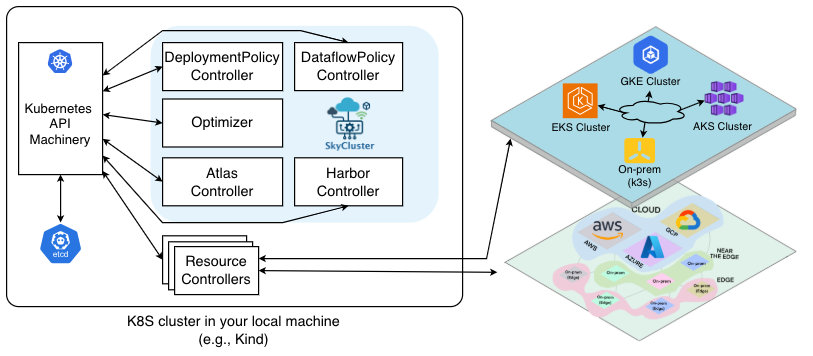

.. meta::
  :description: SkyCluster getting started guide overview.

.. toctree::
  :maxdepth: 2
  :hidden:

  Overview <self>
  installation
  providers-auth
  providers-profile
  examples
  
  
Getting Started
################

What is SkyCluster?
=====================

SkyCluster is a Kubernetes-based platform designed to simplify the deployment, management, and scaling of applications in a cloud-native environment. It provides a robust architecture that leverages Kubernetes' capabilities to support deploying and managing containerized applications across multiple cloud providers and on-premises environments.

With SkyCluster, users can easily create and manage Kubernetes clusters across cloud providers, with built-in support for inter-cluster networking, service discovery and traffic management while minimizing the cost and complexity typically associated with multi-provider deployments.

.. warning::

  This is a Work In Progress (WIP). The documentation is not complete yet and the code base changes frequently.

Architecture
=====================

The overall architecture of SkyCluster consists of several key components as shown below:

The ``skycluster-operator`` runs in a your local Kubernetes cluster, acting as a broker across registered providers, including cloud hyperscalers, edge, and private clouds, to deploy services in a provider-agnostic way with seamless inter-service connectivity. The ultimate goal is to provide a unified platform for deploying and managing applications across diverse environments.

The main components of SkyCluster include:

- **DeploymentPolicy Controller**: Manages deployment policies that define requirements corresponding to each task within your application pipeline.
- **DataflowPolicy Controller**: Oversees dataflow policies that specify the data dependency between two tasks.
- **Optimizer**: Analyzes deployment and dataflow policies to generate an optimized deployment plan across multiple providers. The optimzier solves an ILP problem to minimize deployment and transfer costs while satisfying performance and compliance requirements.
- **Atlas Controller**: Deploy and provision resources and services across multiple providers based on the optimized deployment plan.
- **Harbor Controller**: Deploy and manage application components within the provisioned environment. 

In addition to components outlined above, SkyCluster also includes the following components:

- **ProviderProfile Controller**: Handles provider profiles that each provider metadata (e.g., enabled region and zones).
- **DeviceNode Controller**: Manages edge device nodes that are registered to SkyCluster for edge deployments.

SkyCluster facilitates the deployment of complex, geo-distributed applications by abstracting the underlying infrastructure and providing a seamless experience for users. 