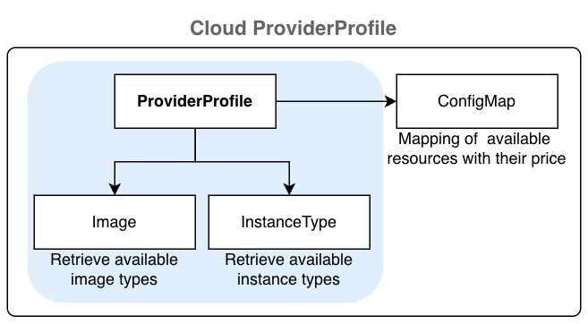
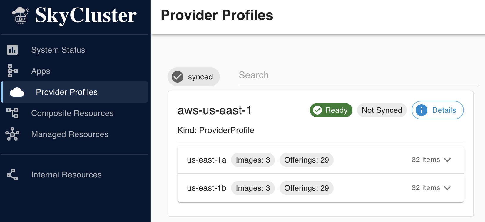
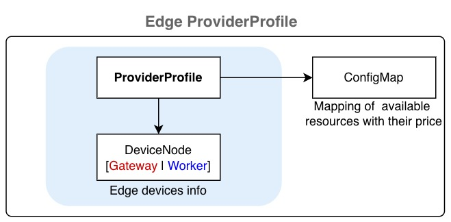

Providers Profiles
#######################

.. toctree::
  :hidden:

.. _NVIDIA: https://docs.nvidia.com/datacenter/cloud-native/container-toolkit/install-guide.html

By creating a ``ProviderProfile`` resource, you can register cloud and on-premises providers with SkyCluster. When a provider profile is created, the SkyCluster operator automatically detects available images and instance types for major cloud providers such as AWS, Azure, and GCP. For OpenStack and baremetal providers, these services must be configured manually.

Quick jump to:

  - :ref:`cloud-providers`
  - :ref:`on-premises-openstack`
  - :ref:`on-premises-edge`

.. _cloud-providers:

Setting Up Cloud Providers
=============================

A provider is identified by its platform name and region and primary zone. When you create a ``ProviderProfile`` for a (cloud) provider, the SkyCluster operator automatically detects available images and instance types for major cloud providers such as AWS, Azure, and GCP by creating **Image** and **InstanceType** resources and stores the information in a ConfigMap in the ``skycluster-system`` namespace.

The following examples show how to configure the a ``ProfileProvider``. Create a YAML file with the content below and use it with ``skycluster profile create -f <file>`` command.

.. tabs::

  .. tab:: AWS

      .. code-block:: yaml

        platform: aws # Platform can be aws, azure, gcp
        region: us-east-1  # Region identifier
        regionAlias: us-east
        continent: north-america
        enabled: true
        zones:
          - name: us-east-1a   # Zone identifier
            locationName: us-east-1a
            defaultZone: true # Only one zone can be default
            enabled: true
            type: cloud  # Optional
          - name: us-east-1b    # Zone identifier
            locationName: us-east-1b
            defaultZone: false
            enabled: true
            type: cloud  # Optional

  .. tab:: GCP

      .. code-block:: yaml

        platform: gcp # Platform can be aws, azure, gcp
        region: us-east1  # Region identifier
          regionAlias: us-east
          continent: north-america
          enabled: true
          zones:
            - name: us-east1-b   # Zone identifier
              locationName: us-east1-b
              defaultZone: true # Only one zone can be default
              enabled: true
              type: cloud  # Optional
            - name: us-east1-c    # Zone identifier
              locationName: us-east1-c
              defaultZone: false
              enabled: true
              type: cloud  # Optional

  .. tab:: Azure

      .. warning::
        Azure support is limited and some features may not work.

      .. code-block:: yaml

        platform: azure # Platform can be aws, azure, gcp
        region: eastus  # Region identifier
          regionAlias: eastus
          continent: north-america
          enabled: true
          zones:
            - name: "1"   # Zone identifier
              locationName: eastus-1
              defaultZone: true # Only one zone can be default
              enabled: true
              type: cloud  # Optional
            - name: "2"    # Zone identifier
              locationName: eastus-2
              defaultZone: false
              enabled: true
              type: cloud  # Optional

Then apply the configuration by running the following command:

.. code-block:: sh

  skycluster profile create -f <provider-profile-file>.yaml -n <provider-name>

After creating a ``ProfileProvider`` resource, the SkyCluster operator generates a ConfigMap in the ``skycluster-system`` namespace containing the available images and instance types for that provider. Verify that the provider profile is ready by checking its status:

.. code-block:: sh

  skycluster profile list
  # NAME            REGION      READY
  # aws-us-east-1   us-east-1   Ready

  # optional: You can also verify the created ConfigMap
  # List the config maps for the provider profile
  kubectl get cm -n skycluster-system \
    -l skycluster.io/config-type=provider-profile
  # NAME                  DATA   AGE
  # aws-us-east-1-8h8j4   3      8h
  # gcp-us-east1-lfp95    3      8h

You can also check the status of ProviderProfile resource and its dependency within dashboard:

.. _on-premises-openstack:

Setting Up On-premises Providers
====================================

OpenStack
^^^^^^^^^^^^^

Similar to cloud provider, an on-premises or private cloud (openstack platform) is identified by its platform name and region and primary zone. In contrast to major cloud providers, the SkyCluster operator cannot automatically detect available images and instance types for on-premises providers. Therefore, you need to create dependency 
resources to for the provider manually. The following example shows how to configure the OpenStack 
provider for the on-premises ``savi`` edge cluster with ``scinet`` region with primary zone ``default``.

Provider Profiles
---------------------------------

.. code-block:: yaml

    platform: openstack
    region: scinet
    regionAlias: scinet # Optional
    continent: north-america # Optional
    enabled: true
    zones:
      - name: default
        locationName: default # Optional
        defaultZone: true
        enabled: true
        type: edge

.. note::

  ``ProviderProfile`` status becomes ``Ready`` when the dependency resources are created for the provider. Check out 
  the status of the ``ProviderProfile`` resource by running the following command. You should see the ``Ready`` 
  status set to ``False`` when you create the object for the first time. It will change to ``True`` once the 
  dependency objects are created.

  .. code-block:: sh

    skycluster profile list
    # NAME                  REGION      READY
    # savi-scinet-default   scinet      False

The operator creates a config map for each provider profile that constains offerings by the provider. You can verify the config map by running the following command:

.. code-block:: sh

  # Change the label value to match your provider profile name
  kubectl get configmap -n skycluster-system \
    -l skycluster.io/provider-profile=savi-scinet-default

Dependency Resources 
---------------------------------------

The following dependency resources are needed to 
ensure ``ProviderProfile`` becomes ready and can be used:

Images 
********

You need to configure the available images **manually** in `skycluster-system` namespace for on-premises providers. 
The following example shows how to configure images including ``ubuntu-20.04``, ``ubuntu-22.04`` and ``ubuntu-24.04`` for the ``savi-scinet-default`` provider profile for the ``scinet`` region.

.. code-block:: yaml

  apiVersion: core.skycluster.io/v1alpha1
  kind: Image
  metadata:
    name: savi-scinet-default-images
    namespace: skycluster-system
  spec:
    providerRef: savi-scinet-default
    # Must match the provider profile name in the Provider resource

    images:
      - zone: default
        nameLabel: ubuntu-20.04
        name: ubuntu-20.04 # Local identifier corresponding to the image
      - zone: default
        nameLabel: ubuntu-22.04
        name: ubuntu-22.04 # Local identifier corresponding to the image
      - zone: default
        nameLabel: ubuntu-24.04
        name: ubuntu-24.04 # Local identifier corresponding to the image

Check the status of ``Image`` resource by running the following command:

.. code-block:: sh

    kubectl get images.core.skycluster.io -n skycluster-system
    # NAME                         REGION      READY
    # savi-scinet-default-images   scinet      True

Instance Type
**************

To configure the instance types, you need to create an ``InstanceType`` resource in `skycluster-system` namespace. The following example shows how to introduce available instance types.

.. code-block:: yaml

  apiVersion: core.skycluster.io/v1alpha1
  kind: InstanceType
  metadata:
    name: savi-scinet-default-instance-types
    namespace: skycluster-system
  spec:
    providerRef: savi-scinet-default
    # Must match the provider name in the Provider resource

    offerings:
      - zone: default
        zoneOfferings:
          - name: m1.small
            nameLabel: 1vCPU-2GB
            generation: m1
            # we don't consider spot pricing for on-premises providers
            price: "0.0015" 
            ram: 2GB
            vcpus: 1
            gpu:
              count: 1
              enabled: true
              manufacturer: NVIDIA
              model: T4
              memory: 16GB
          - name: n1.small
            nameLabel: 1vCPU-4GB
            vcpus: 1
            ram: 4GB
            price: "0.02"

Check the status of the ``InstanceType`` resource by running the following command:

.. code-block:: sh

    kubectl get instancetype.core.skycluster.io -n skycluster-system
    # NAME                                 REGION      READY
    # savi-scinet-default-instance-types   scinet      True

Once all dependency resources are created and ready, the ``ProviderProfile`` status changes to ``Ready``. At this point, you can use the provider profile to create resources in your cluster. To verify its status, run:

.. code-block:: sh

    kubectl get providerprofile -n skycluster-system
    # NAME                  REGION      READY
    # savi-scinet-default   scinet      True

.. _on-premises-edge:

Edge Providers
^^^^^^^^^^^^^^^^^^^^^^^^^^^^^^

Edge providers can be registered similarly to cloud providers but you must create ``DeviceNode`` resources in ``skycluster-system`` namespace to supply edge device configuration such as the gateway node address, required keys, and edge-device details.

Provider Profiles
---------------------------------

.. code-block:: yaml

    apiVersion: core.skycluster.io/v1alpha1
    kind: ProviderProfile
    metadata:
      name: savi-toronto-default
      namespace: skycluster-system
    spec:
      platform: baremetal
      region: toronto
      regionAlias: toronto # Optional
      continent: north-america # Optional
      enabled: true
      zones:
        - name: default
          locationName: BahenBuilding # Optional
          defaultZone: true
          enabled: true
          type: edge

The ``baremetal`` type requires specifying gateway connection and access details, along with worker node data and their capabilities. You must configure this by creating ``DeviceNode`` resources:

Device Nodes
  -------------

The ``DeviceNode`` API represents an edge device that can run workloads. A DeviceNode resource can be defined as either a gateway or a worker node by setting its ``type`` field. By default the gateway node does not run any workload. The ``DeviceNode`` resource are created in the `skycluster-system` namespace.

.. tabs::

  .. tab:: Gateway

      .. code-block:: yaml

        apiVersion: core.skycluster.io/v1alpha1
        kind: DeviceNode
        metadata:
          name: savi-toronto-gw
          namespace: skycluster-system
        spec:
          providerRef: savi-toronto-default
          deviceSpec:
            type: gateway
            zone: default
            
            publicIp: x.y.z.w

            # by default the subnet mask is /24 for this network
            privateIp: 10.23.100.22
            
            auth:
              privateKeySecretRef:
                # secret containing the private SSH key, see below
                name: savi-toronto-edge-ssh-key
                key: privateKey
              username: ubuntu

  .. tab:: Worker

      .. code-block:: yaml

        apiVersion: core.skycluster.io/v1alpha1
        kind: DeviceNode
        metadata:
          name: savi-toronto-edge-jetson-nano1
          namespace: skycluster-system
        spec:
          providerRef: savi-toronto-edge
          deviceSpec:
            type: worker
            zone: default

            privateIp: 10.23.100.200
            # must be reachable from the gateway node
            
            auth:
              username: ubuntu
              # same private key as the gateway node will be used
            
            configs:
              name: Jetson Nano
              cpus: 1
              ram: 4GB
              gpu: 
                count: 472
                unit: GFLOPS # GFLOPS | TFLOPS | TOPS | GPU
                enabled: true
                manufacturer: NVIDIA
                memory: Maxwell
                model: JetsonNano
              storage: 100GB
              price: "0"

NVIDIA Device Preparation
^^^^^^^^^^^^^^^^^^^^^^^^^^^^

SkyCluster supports DeviceNode resources equipped with NVIDIA GPUs by installing a local K3s cluster and joining the devices as worker nodes. To enable GPU workloads, the devices must have the NVIDIA Container Runtime installed. Since installation steps vary depending on the device specifications (e.g., Jetson, desktop GPUs), you need to follow the official `NVIDIA instructions <NVIDIA_>`_ to set up the toolkit. This toolkit allows containers to access the GPU resources on the Jetson device, enabling GPU-accelerated applications to run smoothly.

After setting up the toolkit, ensure that your containerized applications are configured to utilize the GPU resources effectively. You may need to specify the appropriate runtime and environment variables in your container configurations to leverage the GPU capabilities.

