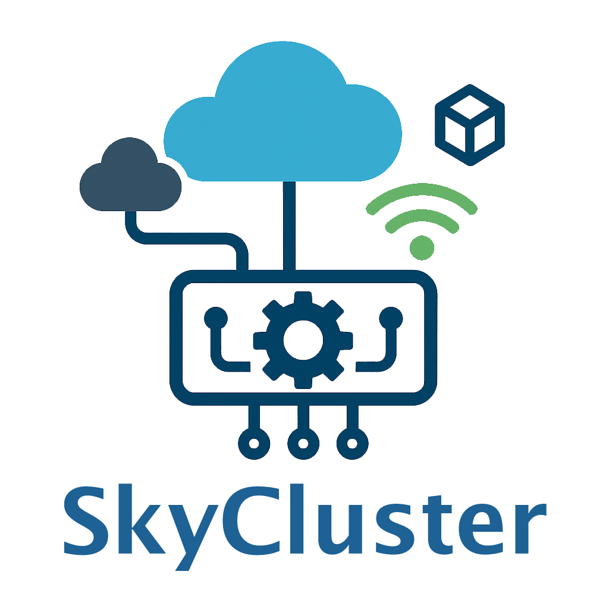

.. title:: SkyCluster

.. meta::
  :description: SkyCluster is a Kubernetes-based platform to simplify geo-distributed application deployment and management across Edge and hybrid multi-clouds environment.

``SkyCluster`` is a research project focused on studying 
the deployment of containerized applications and AI pipelines in edge and hybrid multi-cloud environments. 
The project's goal is to simplify the deployment process by 
offering same interfaces as Kubernetes, but with enhanced 
capabilities to deploy applications and services across various providers. SkyCluster currently supports **AWS** and **GCP** cloud providers (Azure support is coming soon), along with **openstack-based** private clouds and edge devices.

SkyCluster reduces deployment efforts and costs while ensuring your setup and 
application meets performance and compliance requirements.

Read the documentation to learn more about the project and how to use it.

.. toctree::
  :maxdepth: 2
  :hidden:

  getting-started/index
  examples/index
  references/index